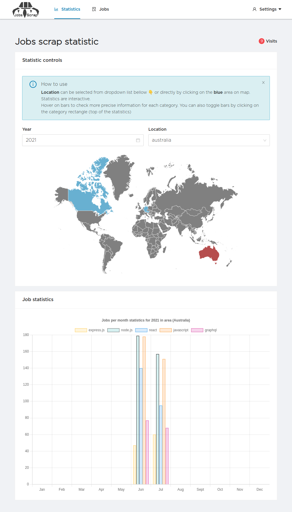

# linkedin-search-statistics

Jobs scrap for automated search and statistics research.

# How it works?

We are counting on a library called `linkedin-jobs-scraper` which the last running `puppeteer` internally to search via `Linkedin` public jobs. I added few extra functionality to bind the the library with `cron` jobs. Cron jobs run the script 3 times a day and store the result in `mongoDb`.

# What are the result?

I used this app to monitor few things like:

- Monitor job stacks in different countries.
- Check the new jobs that are related to my skills.
- Check the retention of the jobs that are acquire specific skills via chart.
- Compare Jobs between months.
- Keep me up to date with the new jobs.

# Check out yourself

[https://www.ahmedhameed.dev/jobs-scrap/?location=canada&year=2021](https://www.ahmedhameed.dev/jobs-scrap/?location=canada&year=2021)

# My portfolio

[https://www.ahmedhameed.dev](https://www.ahmedhameed.dev)
